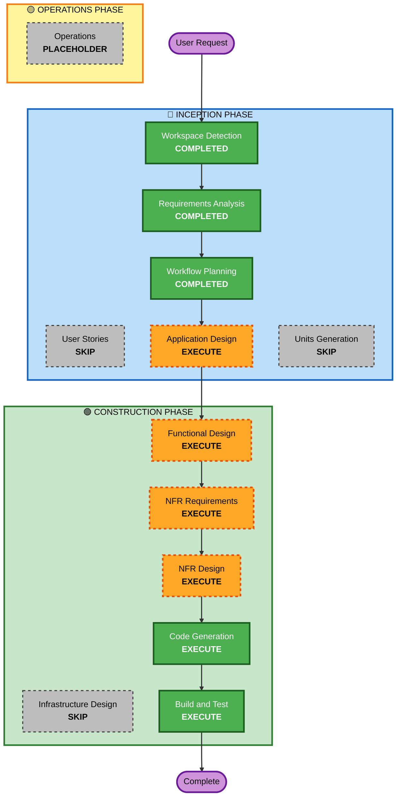

# Execution Plan

## Detailed Analysis Summary

### Change Impact Assessment

- **User-facing changes**: Yes - Complete game UI and gameplay experience
- **Structural changes**: Yes - New game architecture from scratch
- **Data model changes**: Yes - Game state, player state, wall objects, score tracking
- **API changes**: No - Browser-based game with no external APIs
- **NFR impact**: Yes - 60 FPS performance requirement, audio playback, localStorage

### Risk Assessment

- **Risk Level**: Low
- **Rollback Complexity**: Easy - Single-page application with no backend
- **Testing Complexity**: Simple - Browser-based manual testing

## Workflow Visualization

## Phases to Execute

### 🔵 INCEPTION PHASE

- [x] Workspace Detection (COMPLETED)
- [x] Requirements Analysis (COMPLETED)
- [x] User Stories (SKIPPED)
- [x] Workflow Planning (COMPLETED)
- [ ] Application Design - EXECUTE
  - **Rationale**: Need to define game components (Player, Wall, Game Engine, Renderer, Input Handler, Audio Manager, UI Manager) and their interactions
- [ ] Units Generation - SKIP
  - **Rationale**: Single cohesive game application, no need for multiple units of work

### 🟢 CONSTRUCTION PHASE

- [ ] Functional Design - EXECUTE
  - **Rationale**: Game mechanics require detailed design (physics calculations, collision detection algorithms, game loop timing, state transitions)
- [ ] NFR Requirements - EXECUTE
  - **Rationale**: 60 FPS performance requirement needs specific technical approach (requestAnimationFrame, delta time calculations, optimization strategies)
- [ ] NFR Design - EXECUTE
  - **Rationale**: Need to incorporate performance patterns and optimize rendering pipeline
- [ ] Infrastructure Design - SKIP
  - **Rationale**: Browser-based game with no cloud infrastructure or deployment architecture needed
- [ ] Code Generation - EXECUTE (ALWAYS)
  - **Rationale**: Implementation of game code
- [ ] Build and Test - EXECUTE (ALWAYS)
  - **Rationale**: Testing and validation

### 🟡 OPERATIONS PHASE

- [ ] Operations - PLACEHOLDER
  - **Rationale**: Future deployment and monitoring workflows

## Recommended Execution Plan

I recommend executing 6 stages:

🔵 **INCEPTION PHASE:**

1. Application Design - Define game components and their responsibilities

🟢 **CONSTRUCTION PHASE:** 2. Functional Design - Design game mechanics and algorithms 3. NFR Requirements - Determine performance optimization approach 4. NFR Design - Incorporate 60 FPS patterns 5. Code Generation - Implement the game 6. Build and Test - Validate functionality

I recommend skipping 3 stages:

🔵 **INCEPTION PHASE:**

1. User Stories - Simple game with single user type, clear mechanics
2. Units Generation - Single cohesive application, no decomposition needed

🟢 **CONSTRUCTION PHASE:** 3. Infrastructure Design - No cloud infrastructure or deployment architecture

**Estimated Timeline**: 6 stages to complete

## Success Criteria

- **Primary Goal**: Fully functional Flappy Bird clone with ghost character
- **Key Deliverables**:
  - HTML file with game canvas
  - JavaScript game engine with physics and collision detection
  - CSS for styling
  - Integrated audio and sprite assets
- **Quality Gates**:
  - 60 FPS performance achieved
  - Collision detection accurate
  - Score tracking and persistence working
  - All game states functional
